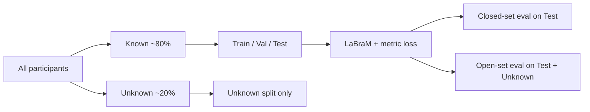

# EEG User Identification with LaBraM: ArcFace vs. FaceNet Triplet Loss

**A technical comparison of metric-learning objectives for closed-set and open-world recognition**

---

## Slide 1 — Title & Scope

**Goal:** Identify individuals from resting-state EEG segments in a **large-scale, open-world** setting.

| Component | Choice |
|-----------|--------|
| Backbone | **LaBraM** (Large Brain Model), fine-tuned from `labram-base.pth` |
| Segment length | **4 s** |
| Loss functions compared | **ArcFace** (Deng et al., CVPR 2019) vs. **FaceNet triplet** (Schroff et al., CVPR 2015) |
| Evaluation | **Closed-set** (known users only) + **Open-set** (known + held-out unknown users) |
| Cross-validation | **5-fold**, ~20% unknown participants per fold |

---

## Slide 2 — Problem Formulation

### Closed-set user identification

Given an EEG segment \(x\), assign it to one of \(C\) **enrolled** identities:

\[
\hat{y} = \arg\max_{c \in \{1,\ldots,C\}} \; s(x, c)
\]

where \(s(x,c)\) is a similarity score between the embedding \(f(x)\) and class \(c\).

In our setup: **\(C \approx 2{,}500\)** known users per fold.

### Open-world (open-set) user identification

The system must **both**:

1. **Recognize** enrolled users (test split), and  
2. **Reject** never-seen users (unknown split, label \(-1\)).

\[
\hat{y} =
\begin{cases}
\arg\max_c s(x,c) & \text{if } \text{known\_user\_score}(x) \geq \tau \\
\text{UNKNOWN} & \text{otherwise}
\end{cases}
\]

**Open-set accuracy** = fraction of correct known-ID assignments **plus** correct unknown rejections, evaluated on **test ∪ unknown** with threshold \(\tau\) tuned on the known-user score.

> Unknown users are **created at preprocessing** (held-out 20% per fold), **never seen during training**, and **evaluated only at analysis time** — the same protocol for ArcFace and triplet.

---

## Slide 3 — Data & Experimental Protocol



| Setting | Detail |
|---------|--------|
| Preprocessing | 5-fold CV, `--consider_unknown`, 20% unknown per fold |
| HDF5 layout | `~/scratch/4s/fold_{0..4}` |
| Tasks | **Active** (eyes open / task) and **Passive** (eyes closed / rest) evaluated separately |
| Backbone init | LaBraM-base pretrained on ~2,500 h EEG ([Jiang et al., ICLR 2024](https://arxiv.org/abs/2405.18765)) |
| Fine-tuning | Full backbone + projection head; AdamW, layer decay 0.9, lr \(5\times10^{-4}\), 200 epochs max |
| Early stopping | Patience 10 on validation metric (ArcFace: val acc; triplet: val prototype CE loss) |

**Fair comparison:** identical HDF5 folds, LaBraM checkpoint, segment length, batch infrastructure, and open-set pipeline (`analyze_confidence.py`).

---

## Slide 4 — LaBraM Backbone

**Reference:** Jiang, et al. *Large Brain Model for Learning Generic Representations with Tremendous EEG Data in BCI.* ICLR 2024. [arXiv:2405.18765](https://arxiv.org/abs/2405.18765)

### Key ideas

1. **Patch-based tokenization** — EEG is split into channel patches; a vector-quantized neural tokenizer maps patches to discrete codes.
2. **Masked modeling** — Transformer predicts masked patch codes on ~2,500 hours of heterogeneous EEG.
3. **Cross-dataset generalization** — handles varying electrode counts and segment lengths.

### Our adaptation for user ID

```
EEG segment (60 ch × T samples)
        ↓
LaBraM encoder (fine-tuned)
        ↓
Feature projection head  →  L2-normalized embedding  z ∈ R^d,  ||z||_2 = 1
        ↓
Metric-learning head (ArcFace or Triplet)
```

LaBraM provides **generic spatiotemporal EEG representations**; the metric-learning objective shapes the embedding geometry for identity discrimination.

---

## Slide 5 — ArcFace: Additive Angular Margin Loss

**Reference:** Deng, et al. *ArcFace: Additive Angular Margin Loss for Deep Face Recognition.* CVPR 2019. [arXiv:1801.07698](https://arxiv.org/abs/1801.07698)

### Motivation

Standard softmax encourages separability but **does not explicitly enforce angular margins** between classes on the hypersphere. ArcFace adds an **additive angular margin** \(m\) to the target class, directly optimizing geodesic distance.

### Formulation

L2-normalize embedding \(\mathbf{z}_i\) and class weight \(\mathbf{W}_j\):

\[
\cos\theta_j = \mathbf{W}_j^\top \mathbf{z}_i
\]

For the ground-truth class \(y_i\), replace \(\cos\theta_{y_i}\) with:

\[
\cos(\theta_{y_i} + m)
\]

Then apply scaled softmax (scale \(s\), e.g. 64):

\[
\mathcal{L}_{\text{ArcFace}} = -\log \frac{e^{s\cos(\theta_{y_i}+m)}}{e^{s\cos(\theta_{y_i}+m)} + \sum_{j\neq y_i} e^{s\cos\theta_j}}
\]

### Geometric interpretation

| Property | Effect |
|----------|--------|
| Hypersphere constraint | Features and weights live on \(\mathbb{S}^{d-1}\) |
| Additive margin in **angle space** | Enforces a minimum angular gap between classes |
| Direct softmax over all \(C\) classes | Every mini-batch sees the full classification boundary |

### Training (our setup)

| Hyperparameter | Value |
|----------------|-------|
| Margin \(m\) | 0.5 |
| Scale \(s\) | 256 |
| Batch size | 384–512 |
| Sampling | Random shuffle (all classes reachable each epoch) |

### Inference

- **Closed-set:** \(\hat{y} = \arg\max_j \cos(\mathbf{W}_j^\top \mathbf{z})\) or ArcFace logits at eval.  
- **Open-set:** train-split **L2 centroids** per user → OOD distance → known-user score \(= 1/(1 + d_{\text{OOD}})\).

---

## Slide 6 — FaceNet Triplet Loss

**Reference:** Schroff, et al. *FaceNet: A Unified Embedding for Face Recognition and Clustering.* CVPR 2015. [arXiv:1503.03832](https://arxiv.org/abs/1503.03832)

### Motivation

Learn an embedding where **Euclidean distance reflects semantic similarity** without a fixed softmax classifier over thousands of classes. Identity is defined by **relative distance**, not a weight vector per class.

### Triplet loss

For anchor \(a\), positive \(p\) (same user), negative \(n\) (different user):

\[
\mathcal{L}_{\text{triplet}} = \sum_{(a,p,n)} \left[\ \|f(a)-f(p)\|_2^2 - \|f(a)-f(n)\|_2^2 + \alpha\ \right]_+
\]

Margin \(\alpha = 0.2\) (FaceNet default).

**Objective:** pull same-user pairs together, push different-user pairs apart by at least \(\alpha\).

### Online triplet mining

| Strategy | Definition | Use |
|----------|------------|-----|
| **Semi-hard** (default) | \(d(a,p) < d(a,n) < d(a,p)+\alpha\) | Stable convergence; FaceNet paper default |
| Batch-hard | Hardest positive & negative in batch | Stronger but can collapse early |
| All valid | All violating triplets | Most expensive |

> Schroff et al. note that **hardest-only** mining can collapse embeddings early; **semi-hard** negatives lie inside the margin but remain informative.

### P×K batching (critical at ~2,500 users)

Random mini-batches rarely contain enough same-user pairs for triplet mining. We use **PK sampling**:

- **P = 32** identities per batch  
- **K = 12** segments per identity  
- **128 extra random negatives** (out-of-batch)  
- **Batch size = 32×12 + 128 = 512**

This mirrors FaceNet's insight: triplet quality depends on **batch composition**, not just batch size.

### Training vs. evaluation asymmetry

| Phase | Mechanism |
|-------|-----------|
| **Training** | Triplet loss only on batch embeddings; monitor **batch-local** prototype accuracy (~P classes) |
| **Val / Test** | Refresh **full train centroids** each epoch; nearest prototype over all ~2,500 users |
| **Open-set** | Same centroid geometry + OOD distance as ArcFace (`analyze_confidence.py`) |

---

## Slide 7 — ArcFace vs. Triplet: Conceptual Comparison

| Aspect | ArcFace | FaceNet Triplet |
|--------|---------|-----------------|
| **Supervision signal** | Angular margin + softmax over all classes | Relative distance constraints (triplets) |
| **Class weights** | Learnable \(\mathbf{W}_c \in \mathbb{R}^d\) per user | Train-split **prototypes** (mean embeddings) |
| **Mini-batch requirement** | Any shuffle suffices | **P×K** structured batches essential |
| **Gradient signal** | Global (all \(C\) classes in softmax) | Local (pairs/triplets in batch) |
| **Typical challenge at 2,500 users** | Well-studied; strong baselines | Harder convergence; needs careful mining & sampling |
| **Closed-set inference** | ArcFace logits / cosine to weights | Nearest L2-normalized prototype |
| **Open-set inference** | Centroid OOD + known-user score | **Identical** pipeline |


**Key insight:** Open-set evaluation is **loss-agnostic** — both methods map to the same geometric test: *how far is this segment from the known-user manifold in embedding space?*

---

## Slide 8 — Open-Set Evaluation Pipeline (Both Methods)

**Shared protocol** (`analyze_confidence.py`, `--split both`, `--task_type active|passive`):

1. **Compute train centroids** — mean L2-normalized embedding per known user on the training split.  
2. **OOD distance** — \(d_{\text{OOD}}(x) = \min_c \| \mathbf{z}_x - \boldsymbol{\mu}_c \|_2\).  
3. **Known-user score** — \(\text{score}(x) = 1 / (1 + d_{\text{OOD}}(x))\).  
4. **Threshold sweep** — reject as UNKNOWN if score \(< \tau\); tune \(\tau\) to maximize open-set accuracy on test+unknown.  
5. **Closed-set metrics** — accuracy, macro F1, FPR/FNR on **test** (known users only).

Outputs per fold: `open_set_summary.json`, confidence plots, `unknown_confidence_summary.json`.

---

## Slide 9 — Results: Closed-Set Test Accuracy (4s, 5 folds)

### Per-fold test accuracy (%)

| Fold | Triplet Active | ArcFace Active | Triplet Passive | ArcFace Passive |
|:----:|:-------------:|:-------------:|:--------------:|:--------------:|
| 0 | 97.07 | 97.07 | 96.85 | 96.58 |
| 1 | 97.20 | 97.05 | 96.91 | 96.68 |
| 2 | 97.36 | 97.08 | 97.06 | 96.70 |
| 3 | 97.29 | 96.86 | 96.96 | 96.67 |
| 4 | 97.19 | 97.28 | 96.85 | 97.02 |

### Aggregate (mean ± std)

| Metric | Triplet | ArcFace | Δ (Triplet − ArcFace) |
|--------|---------|---------|:---------------------:|
| Test acc — **active** | **97.22 ± 0.11%** | 97.07 ± 0.15% | **+0.16%** |
| Test acc — **passive** | **96.93 ± 0.09%** | 96.73 ± 0.17% | **+0.19%** |
| F1 macro — active | 95.90 ± 0.19% | **96.09 ± 0.13%** | −0.19% |
| F1 macro — passive | **96.50 ± 0.15%** | 96.16 ± 0.20% | **+0.34%** |

**Takeaway:** On **known-user** test data, both methods reach **~97%** accuracy. Triplet is marginally ahead on accuracy; ArcFace slightly ahead on active F1 macro. Differences are **small** — essentially tied on closed-set.

---

## Slide 10 — Results: Open-Set Accuracy (Open World)

Open-set accuracy on **test (known) + unknown (held-out)** with tuned threshold on known-user score.

### Per-fold open-set accuracy (%)

| Fold | Triplet Active | ArcFace Active | Triplet Passive | ArcFace Passive |
|:----:|:-------------:|:-------------:|:--------------:|:--------------:|
| 0 | **96.67** | 95.20 | **96.07** | 94.00 |
| 1 | **95.78** | 94.07 | **95.17** | 93.39 |
| 2 | **96.22** | 94.62 | **95.14** | 93.38 |
| 3 | **96.32** | 94.53 | **95.02** | 93.45 |
| 4 | **96.07** | 95.75 | **95.57** | 94.84 |

### Aggregate (mean ± std)

| Metric | Triplet | ArcFace | Δ (Triplet − ArcFace) |
|--------|---------|---------|:---------------------:|
| Open-set — **active** | **96.21 ± 0.33%** | 94.83 ± 0.65% | **+1.38%** |
| Open-set — **passive** | **95.39 ± 0.43%** | 93.81 ± 0.63% | **+1.58%** |

### Optimal rejection threshold

| Method | Active threshold | Passive threshold |
|--------|:----------------:|:-----------------:|
| **Triplet** | 0.65 (all folds) | 0.65 (all folds) |
| **ArcFace** | 0.80 (folds 0–3), 0.85 (fold 4) | 0.80 / 0.85 |

**Takeaway:** Triplet wins **every fold** on open-set (+0.3 to +2.1 pp). It achieves **higher open-set accuracy at a lower rejection threshold**, indicating **cleaner separation** between known and unknown users in embedding space.

---

## Slide 11 — Embedding Geometry (Triplet Training Diagnostics)

During triplet training we monitor **inter-class vs. intra-class distance ratio**:

\[
\text{ratio} = \frac{\mathbb{E}[d_{\text{inter}}]}{\mathbb{E}[d_{\text{intra}}]}
\]

| Signal | Collapsed / poor | Healthy (our runs) |
|--------|------------------|---------------------|
| inter/intra ratio | ~1.0 | **> 3.0** (final folds) |
| Val accuracy | ~0.04% (random 1/2500) | **~97%** |
| `tri_active` (active triplets) | ~0 | **> 0.02** |

Triplet training initially appeared to fail (~0.36% val) until we fixed **P×K epoch length**, **LR schedule steps/epoch**, and **train accuracy metric** (batch-local vs. misleading 2500-way EMA). After fixes, separation ratio rose from ~1.1 to **~3.1–3.5**, consistent with usable identity clusters.

---

## Slide 12 — Discussion

### Why closed-set is nearly tied

Both losses, combined with a strong LaBraM backbone, produce **highly separable** embeddings for ~2,500 known users. ArcFace's global softmax and triplet's local distance constraints **converge to similar manifold structure** when training succeeds.

### Why triplet wins open-set

Open-set depends on **distance to the known-user manifold**, not argmax over 2,500 logits:

1. Triplet **directly optimizes** \(\|z_a - z_p\|^2 \ll \|z_a - z_n\|^2\) — aligned with OOD geometry.  
2. ArcFace optimizes **angular margins to class weights**; unknown rejection is a **post-hoc** centroid test, not the training objective.  
3. Lower optimal threshold (0.65 vs. 0.80) suggests triplet embeddings yield **more calibrated** known-vs-unknown scores.

### Practical trade-offs

| | ArcFace | Triplet |
|---|---------|---------|
| **Training complexity** | Lower (standard CE-style) | Higher (P×K, mining, longer convergence) |
| **Hyperparameter sensitivity** | Moderate | High (batch structure, margin, mining) |
| **Closed-set ceiling** | ~97% | ~97% |
| **Open-set performance** | ~94% active | **~96% active** |
| **Recommendation** | Strong default for large-scale ID | Prefer when **unknown rejection** is critical |

---

## Slide 13 — Conclusions

1. **LaBraM + metric learning** achieves **~97% closed-set** user identification on 4 s EEG across 5 folds and ~2,500 users.

2. **ArcFace and FaceNet triplet** are **competitive on closed-set** test accuracy; differences are < 0.2 pp on average.

3. **Triplet loss yields superior open-world performance** — **+1.4 pp (active)** and **+1.6 pp (passive)** open-set accuracy vs. ArcFace, consistently across all folds.

4. Both methods share the **same open-set protocol**: train centroids, OOD distance, known-user score, threshold tuning — enabling **fair, loss-agnostic** comparison.

5. For **production BCI identity systems** that must reject unenrolled users, **triplet metric learning** on LaBraM embeddings is the stronger choice in our experiments, at the cost of more complex training.

---

## Slide 14 — References

| Topic | Citation |
|-------|----------|
| **LaBraM** | Jiang, et al. (2024). *Large Brain Model for Learning Generic Representations with Tremendous EEG Data in BCI.* ICLR 2024. [arXiv:2405.18765](https://arxiv.org/abs/2405.18765) |
| **ArcFace** | Deng, J., Guo, J., & Zafeiriou, S. (2019). *ArcFace: Additive Angular Margin Loss for Deep Face Recognition.* CVPR 2019. [arXiv:1801.07698](https://arxiv.org/abs/1801.07698) |
| **FaceNet / Triplet** | Schroff, F., Kalenichenko, D., & Philbin, J. (2015). *FaceNet: A Unified Embedding for Face Recognition and Clustering.* CVPR 2015. [arXiv:1503.03832](https://arxiv.org/abs/1503.03832) |
| **Triplet mining** | Wikipedia / FaceNet: semi-hard negative mining. [Triplet loss](https://en.wikipedia.org/wiki/Triplet_loss) |
| **Our codebase** | `user_identification/train_labram_arcface.py`, `CNN/models/triplet_loss.py`, `analyze_confidence.py` |
| **Results** | `final_user_identification_triplet/active_passive_test_unknown_eval_summary.json` |
| **ArcFace baseline** | `final_user_identification/final_user_identification_with_base/4s/active_passive_test_unknown_eval_summary.json` |

---

## Appendix A — Training Hyperparameters

### ArcFace (4s, LaBraM fine-tuned)

```
segment_length=4s, batch_size=384, epochs=200, lr=5e-4
arcface_margin=0.5, arcface_scale=256
layer_decay=0.9, weight_decay=0.05, warmup_epochs=10
pretrained_path=LaBraM/checkpoints/labram-base.pth
```

### Triplet (4s, LaBraM fine-tuned)

```
segment_length=4s, batch_size=512, epochs=200, lr=5e-4
loss_type=triplet
triplet_classes_per_batch=32, triplet_samples_per_class=12
triplet_extra_negatives=128, triplet_margin=0.2
triplet_mining=semi_hard
early_stopping_patience=10, early_stopping_min_delta=1e-4
pretrained_path=LaBraM/checkpoints/labram-base.pth
```

---

## Appendix B — Reproducing Evaluation

```bash
# Triplet open-set + active/passive report (all 5 folds)
python user_identification/run_all_folds_active_passive_test_unknown_eval.py \
  --final_root final_user_identification_triplet \
  --hdf5_root_4s "${HOME}/scratch/4s" \
  --n_folds 5 \
  --device cuda \
  --log_dir final_user_identification_triplet
```

Aggregate report: `final_user_identification_triplet/active_passive_test_unknown_eval_summary.json`

Per-fold artifacts:
- `4s/fold_k/eval_task_type_test_accuracy.json` — closed-set active/passive
- `4s/fold_k/eval_test_unknown_active/open_set_summary.json` — open-world active
- `4s/fold_k/eval_test_unknown_passive/open_set_summary.json` — open-world passive

---

*Generated from experimental runs on the EEG user-identification 5-fold benchmark (4 s segments, LaBraM-base fine-tuning, July 2026).*
