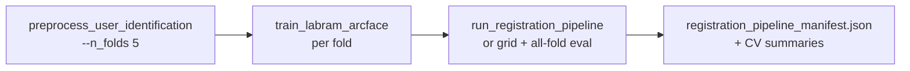

# User Registration Evaluation

Evaluate **open-world user registration** on held-out (**unknown**) participants: enroll a subset of unknown users from their EEG segments, build embedding prototypes, then classify probe segments as a registered identity or `UNKNOWN`.

**Run all commands from the project root** (`EEG/`).

Related docs: [user_identification/README.md](../README.md) (training and open-set analysis), [data_processing/README.md](../../data_processing/README.md) (preprocessing).

## Table of contents

- [How this differs from analyze_confidence.py](#how-this-differs-from-analyze_confidencepy)
- [Prerequisites](#prerequisites)
- [End-to-end workflow](#end-to-end-workflow)
- [Protocol](#protocol-per-fold-and-task)
- [Prediction rules](#prediction-rules)
- [Participant and segment splits](#participant-and-segment-splits)
- [Quick start](#quick-start)
- [Directory layout examples](#directory-layout-examples)
- [Scripts](#scripts)
- [CLI reference](#cli-reference-run_registration_evalpy)
- [Data layout](#data-layout)
- [Threshold selection](#threshold-selection)
- [Outputs and report schema](#outputs)
- [Interpreting metrics](#interpreting-metrics)
- [Grid search and pipeline](#grid-search-and-pipeline)
- [Tuning notes](#tuning-notes)
- [Troubleshooting](#troubleshooting)
- [Constraints](#constraints)

---

## How this differs from `analyze_confidence.py`

| | `registering_users/` (this module) | `analyze_confidence.py` |
|---|-----------------------------------|-------------------------|
| Data used | **Unknown split only** | Train (centroids), test, and/or unknown |
| Protocol | Simulate registration: enroll → prototype → probe + reject unregistered | Closed-set ID + OOD score vs **known** train centroids |
| Threshold | Swept on registration hold-out (enrollment/probe split of unknown users) | Tuned on test + unknown together |
| Use case | “Can we register new users and reject strangers?” | “Does the trained model separate known vs unknown?” |

Both can use **`known_user_score = 1/(1 + d)`** on min L2 distance `d` to prototypes; pass `--threshold_on known_user_score` here for parity with confidence analysis.

---

## Prerequisites

1. **Preprocessed 5-fold user-ID data** with disjoint unknown participants per fold:

```bash
python data_processing/preprocess_user_identification.py \
  --data_root /path/to/preprocessed_new \
  --output_dir /path/to/user_id_5fold \
  --n_folds 5 \
  --segment_length 4s \
  --random_seed 42
```

Each `fold_k/` must contain `eeg_data_unknown_{segment}*.h5` (or `_part*.h5`) and `participant_id_to_class_idx.json`. Verify partitions:

```bash
python data_processing/verify_user_id_fold_partition.py \
  --output_dir /path/to/user_id_5fold --n_folds 5
```

2. **Trained LaBraM + ArcFace checkpoint** per fold from `train_labram_arcface.py` (see parent README). Checkpoint must include:

- `model_state_dict`, `arcface_state_dict`, `num_classes`, `embedding_dim`

3. **Environment:** conda `eeg_env`, CUDA optional (`--device cpu`).

**Single-run data (optional):** For one train/val/test + unknown split (not 5-fold), preprocess with `--consider_unknown` instead of `--n_folds`. Point `--hdf5_dir` at that output directory and use a single checkpoint path. The registration scripts work the same way; cross-fold summaries require multiple folds.

**Training alignment:** Inference uses `LaBraMUserIdentificationWrapper` (60 channels), `run_inference` from `analyze_confidence.py`, and **ArcFace embeddings** (not raw softmax over training class IDs). Hyperparameters (`--model_name`, `--arcface_margin`, `--arcface_scale`, `--dropout_rate`, `--arcface_easy_margin`) must match the training run that produced `best_model.pth`.

---

## End-to-end workflow

Typical order after 5-fold ArcFace training:



1. Preprocess → `hdf5_root/fold_k/` + unknown HDF5 per fold  
2. Train → `cv_dir/fold_k/best_model.pth`  
3. Tune (optional) → `run_registration_grid_search.py` per task  
4. Report → `run_all_folds_registration_eval.py` or full `run_registration_pipeline.py`  

---

## Protocol (per fold and task)

For `task_type` **active** or **passive** (or **both** — runs each separately):

1. Index all segments in the **unknown** HDF5 split for that fold.
2. Randomly split unknown **participants** into registered vs unregistered (`--register_fraction_of_unknown`).
3. For each registered participant, split segments into **enrollment** vs **probe** (`--enrollment_fraction_per_user`).
4. Run the trained model; L2-normalize **ArcFace embeddings**.
5. Build one prototype per registered user (mean enrollment embedding).
6. **Closed-set:** nearest prototype on registered **probe** segments only.
7. **Open-world (K+1):** registered probes + all unregistered segments; reject as `UNKNOWN` when the reject signal exceeds a swept threshold.

Reject signal (default **`distance`**): min L2 distance to any prototype. Alternative: **`known_user_score`** = `1/(1 + d)` (monotone; equivalent decisions, different threshold units).

Train/val/test **known** users are **not** used in enrollment or threshold logic.

### Prediction rules

For each evaluation segment:

1. Compute L2-normalized embedding with the trained LaBraM + ArcFace head.
2. **Nearest registered prototype:** argmin of L2 distance to each enrolled user’s prototype (mean enrollment embedding, re-normalized).
3. **Reject signal:** `d =` that minimum distance, or `score = 1/(1 + d)` if `--threshold_on known_user_score`.

**Open-world decision** (K registered string IDs + one `UNKNOWN` class index):

| Mode | Accept nearest registered ID when… | Else assign |
|------|-----------------------------------|-------------|
| `distance` (default) | `d ≤ τ` (distance threshold) | `UNKNOWN` |
| `known_user_score` | `score ≥ τ` (same semantics as `analyze_confidence.open_set_predict`) | `UNKNOWN` |

The threshold `τ` is chosen by sweeping `threshold_grid_points` values between the min and max observed signal on the **evaluation pool** (registered probes + all unregistered segments), optimizing `--threshold_criterion`.

**Closed-set block** (`registered_user_classification_probe_only`): only registered users’ **probe** segments; labels are registered indices `0 … K-1` (no `UNKNOWN` class). Nearest prototype only — no rejection threshold.

---

## Participant and segment splits

Implemented in `unknown_hdf5_index.split_unknown_participants_for_registration` (seeded with `--seed`):

| Step | What is split | Rule |
|------|----------------|------|
| Register vs unregistered | Unknown **participants** | Random permutation; `round(N × register_fraction)` enrolled, at least 1 registered and 1 unregistered |
| Enrollment vs probe | Each registered user’s **segments** | Segments sorted by `(hdf5_path, task_type, sample_key)`; first `floor(n × enrollment_fraction)` → enrollment, rest → probe (at least 1 each) |

Example: 100 unknown participants, `register_fraction_of_unknown=0.5`, `enrollment_fraction_per_user=0.5`, 20 segments/user → ~50 registered users, ~10 segments enrolled + ~10 probe each, ~50 users fully unregistered.

Task filter: **active** (`ccd` in HDF5) or **passive** (`sus`). Samples are read only from the unknown split’s `active/` or `passive/` groups.

---

## Quick start

**Single fold, active task:**

```bash
python user_identification/registering_users/run_registration_eval.py \
  --checkpoint final_user_identification/4s/fold_0/best_model.pth \
  --hdf5_dir "${HOME}/scratch/fold_0" \
  --segment_length 4s \
  --task_type active \
  --output_dir registering_users_results/fold_0_active \
  --device cuda
```

**All folds (checkpoints at `<cv_dir>/fold_k/best_model.pth`):**

```bash
python user_identification/registering_users/run_all_folds_registration_eval.py \
  --cv_dir final_user_identification/4s \
  --hdf5_root "${HOME}/scratch" \
  --segment_length 4s \
  --task_type active \
  --n_folds 5 \
  --output_root registering_users_results/all_folds_active_4s \
  --device cuda
```

**Recommended end-to-end (grid search active + passive, manifest, final eval):**

```bash
python user_identification/registering_users/run_registration_pipeline.py \
  --cv_dir final_user_identification/4s \
  --hdf5_root "${HOME}/scratch" \
  --segment_length 4s \
  --n_folds 5 \
  --output_root registering_users_results/pipeline_4s \
  --threshold_on known_user_score \
  --device cuda
```

---

## Directory layout examples

**Inputs (5-fold, 4s):**

```
~/scratch/
├── fold_0/
│   ├── eeg_data_unknown_4s_part00.h5
│   ├── eeg_data_train_4s_part00.h5
│   └── participant_id_to_class_idx.json
├── fold_1/ ...
└── fold_4/

final_user_identification/4s/
├── fold_0/best_model.pth
├── fold_1/best_model.pth
└── fold_4/best_model.pth
```

**Outputs (pipeline):**

```
registering_users_results/pipeline_4s/
├── grid_search_active/
│   ├── enroll_0.500__unkw_0.500__regfrac_0.500__crit_weighted_recall_balance/
│   │   └── fold_0/registration_open_set_report.json
│   └── grid_search_ranked_results.json
├── grid_search_passive/
├── registration_pipeline_manifest.json
├── eval_all_folds_active_best_from_grid/
│   ├── fold_0/registration_open_set_report.json
│   └── registration_eval_cv_summary.json
└── eval_all_folds_passive_best_from_grid/
```

Grid config folder names encode: `enroll_{fraction}__unkw_{weight}__regfrac_{register_fraction}__crit_{criterion}`.

---

## Scripts

| Script | Purpose |
|--------|---------|
| `run_registration_eval.py` | Single fold; one checkpoint path via `--checkpoint` |
| `run_all_folds_registration_eval.py` | All folds; checkpoints at `<cv_dir>/fold_k/best_model.pth` |
| `run_registration_grid_search.py` | Hyperparameter grid (enrollment fraction, threshold criterion, etc.) |
| `run_registration_pipeline.py` | Active + passive grids → manifest → all-fold eval with best configs |
| `unknown_hdf5_index.py` | Index unknown samples; participant splits |
| `registration_map_dataset.py` | Map-style loader for indexed unknown segments |

---

## CLI reference (`run_registration_eval.py`)

| Argument | Default | Description |
|----------|---------|-------------|
| `--checkpoint` | (required) | Path to `best_model.pth` from ArcFace training |
| `--hdf5_dir` | (required) | Fold directory with unknown HDF5 files |
| `--segment_length` | (required) | `1s`, `2s`, or `4s` |
| `--task_type` | (required) | `active`, `passive`, or `both` (writes `active/`, `passive/`, plus `registration_open_set_report_both.json`) |
| `--output_dir` | (required) | Output directory |
| `--register_fraction_of_unknown` | `0.5` | Fraction of unknown participants to enroll (0, 1) |
| `--enrollment_fraction_per_user` | `0.5` | Per-user segment fraction for enrollment vs probe (0, 1) |
| `--threshold_criterion` | `f1_macro` | See [Threshold selection](#threshold-selection) |
| `--unknown_recall_weight` | `0.5` | For `weighted_recall_balance` only, in [0, 1] |
| `--threshold_grid_points` | `501` | Grid size (≥ 11) |
| `--threshold_on` | `distance` | `distance` or `known_user_score` |
| `--seed` | `42` | Split reproducibility |
| `--batch_size` | `192` | Inference batch size |
| `--num_workers` | `4` | DataLoader workers |
| `--model_name` | `labram_base_patch200_200` | Must match training |
| `--arcface_margin`, `--arcface_scale` | `0.5`, `256` | Must match training |
| `--arcface_easy_margin` | off | Set if used during training |
| `--dropout_rate` | `0.1` | Must match training |

`run_all_folds_registration_eval.py` adds `--cv_dir`, `--hdf5_root`, `--n_folds` (default `5`) and defaults `--task_type` to `both`. It does **not** take `--checkpoint`; it resolves `cv_dir/fold_k/best_model.pth`.

---

## Data layout

**`--hdf5_dir`** (single fold), e.g. `${HOME}/scratch/fold_0`:

- `eeg_data_unknown_4s.h5` or `eeg_data_unknown_4s_part00.h5`, …
- `participant_id_to_class_idx.json` (known users only; unknown users are not in this map)

**`--hdf5_root`** (all folds): parent of `fold_0` … `fold_{n-1}`.

**`--cv_dir`**: parent of per-fold checkpoints, e.g. `final_user_identification/4s/fold_0/best_model.pth`.

---

## Threshold selection

`--threshold_criterion` values:

- `f1_macro`, `balanced_accuracy`, `accuracy`, `mcc`
- `weighted_recall_balance` — `w * unknown_recall + (1-w) * mean_registered_recall` (`--unknown_recall_weight`)
- `harmonic_recall_balance` — harmonic mean of those recalls

Grid search (`run_registration_grid_search.py`) ranks configs by:

`objective_unknown_weight * unknown_recall_mean + (1 - w) * mean_registered_recall_mean`

Tie-break: higher `open_world_f1_macro_mean`, then `open_world_mcc_mean`.

---

## Outputs

### `run_registration_eval.py` → `--output_dir`

| File | Contents |
|------|----------|
| `registration_open_set_report.json` | Full JSON report (printed to stdout as well) |
| `registration_eval_arrays.npz` | Numeric arrays for plots or post-hoc analysis |

With `--task_type both`, also `active/`, `passive/` subdirs and `registration_open_set_report_both.json`.

### `registration_open_set_report.json` (top-level fields)

| Field | Meaning |
|-------|---------|
| `checkpoint`, `hdf5_dir`, `segment_length`, `task_type` | Run configuration |
| `registered_participant_ids`, `unregistered_participant_ids` | Who was enrolled vs held out as strangers |
| `n_probe_registered_segments`, `n_unregistered_segments` | Segment counts in open-world eval |
| `register_fraction_of_unknown`, `enrollment_fraction_per_user`, `seed` | Split settings |
| `registered_user_classification_probe_only` | Closed-set metrics on registered probes only |
| `open_world_user_classification` | K+1 eval, threshold sweep, selected vs reference threshold |

Under `open_world_user_classification`:

- `selected_threshold` — metrics at the threshold chosen by `--threshold_criterion`
- `reference_max_plain_accuracy` — metrics at the threshold that maximizes plain accuracy on the same pool (for comparison)
- `threshold_sweep_column_names` — columns in the saved sweep matrix
- `assignment_summary` (inside selected/reference) — counts: registered correct, registered rejected as UNKNOWN, registered wrong ID, unregistered correctly rejected

### `registration_eval_arrays.npz`

| Array | Shape / role |
|-------|----------------|
| `registration_prototypes` | `(K, embedding_dim)` L2-normalized enrolled prototypes |
| `dist_probe_to_registered` | Distances from registered probe segments to prototypes |
| `dist_unregistered_to_registered` | Distances from unregistered segments |
| `threshold_sweep` | Grid of metrics vs candidate thresholds |
| `y_true_open_world`, `y_pred_selected`, `y_pred_max_plain_accuracy` | Labels and predictions |
| `nearest_registered_prediction`, `min_distance`, `min_known_user_score` | Per-segment signals |
| `emb_probe`, `emb_unregistered` | Raw embeddings |

### `run_all_folds_registration_eval.py` → `--output_root`

- `fold_k/registration_open_set_report.json` (or `fold_k/active/`, `fold_k/passive/` when `task_type=both`)
- `registration_eval_cv_summary.json` — per-fold payloads plus aggregated keys such as:
  - `open_world_f1_macro_selected_mean` / `_std`
  - `unknown_recall_selected_mean` / `_std`
  - `mean_registered_recall_selected_mean` / `_std`
  - With `task_type=both`, the same metrics prefixed with `active_` and `passive_`

### Grid / pipeline artifacts

| File | Contents |
|------|----------|
| `grid_search_ranked_results.json` | `ranked_configs` (sorted), `best_config`, per-config `aggregate` means/stds across folds |
| `registration_pipeline_manifest.json` | Best active/passive configs, aggregate metrics, `final_eval_commands`, `final_eval_output_roots` |

Each grid config directory contains `fold_0/` … `fold_{n-1}/` with the same JSON/NPZ files as a single-fold run.

---

## Interpreting metrics

| Metric | Meaning | Higher is better? |
|--------|---------|-------------------|
| **Closed-set probe accuracy** | Among enrolled users’ held-out segments, fraction assigned to the correct registered ID (no UNKNOWN) | Yes |
| **Open-world accuracy** | Correct assignments over all probe + unregistered segments (K+1) | Yes, but can favor majority UNKNOWN |
| **unknown_recall** | Fraction of unregistered segments labeled `UNKNOWN` | Yes for security; trade off vs registered recall |
| **mean_registered_recall** | Mean per-registered-user recall in open-world eval | Yes for usability |
| **f1_macro** | Macro-F1 over K+1 classes | Balanced summary |
| **mcc** | Matthews correlation (K+1) | Useful under imbalance |
| **weighted_recall_balance** (criterion) | Explicit trade-off via `--unknown_recall_weight` | Tune for deployment goals |

A strong model often shows high **closed-set probe accuracy** and high **unknown_recall** at a threshold that keeps **mean_registered_recall** acceptable. Compare `selected_threshold` vs `reference_max_plain_accuracy` to see whether the criterion changes the operating point meaningfully.

---

## Grid search and pipeline

**Grid search:**

```bash
python user_identification/registering_users/run_registration_grid_search.py \
  --cv_dir final_user_identification/4s \
  --hdf5_root "${HOME}/scratch" \
  --segment_length 4s \
  --task_type active \
  --n_folds 5 \
  --output_root registering_users_results/grid_search_active_4s \
  --grid_enrollment_fractions "0.5,0.6,0.7" \
  --grid_unknown_recall_weights "0.4,0.5,0.6,0.7" \
  --grid_register_fractions "0.5" \
  --grid_threshold_criteria "weighted_recall_balance,harmonic_recall_balance" \
  --objective_unknown_weight 0.5 \
  --threshold_on known_user_score \
  --device cuda
```

Optional: `--prune_configs --prune_keep_top_k 3` to delete low-ranked config directories.

**Pipeline flags:**

- `--prune_after_grid` — prune after each grid
- `--skip_grid` — resume if `grid_search_ranked_results.json` exists
- `--no_final_eval` — grids + manifest only

---

## Tuning notes

- **Better unknown rejection:** higher `--unknown_recall_weight`, stricter criterion, or `--threshold_on known_user_score` with tuned grid
- **Better registered ID retention:** lower `--unknown_recall_weight`, higher `--enrollment_fraction_per_user` (keep enough probe segments)
- **More enrolled users in simulation:** raise `--register_fraction_of_unknown` (still need ≥1 unregistered participant)
- **Richer prototypes:** raise `--enrollment_fraction_per_user` but leave ≥1 probe segment per user
- **Active vs passive:** tune separately; defaults in `run_registration_pipeline.py` run both grids
- **Reporting:** use all folds (`run_all_folds_registration_eval.py` or pipeline final eval), not a single fold
- **Reproducibility:** fix `--seed` when comparing configs; grid search uses the same seed for every config in a run

### Default pipeline grid (when not overridden)

| Parameter | Default sweep |
|-----------|----------------|
| `grid_enrollment_fractions` | `0.5, 0.6, 0.7` |
| `grid_unknown_recall_weights` | `0.4, 0.5, 0.6, 0.7` |
| `grid_register_fractions` | `0.5` |
| `grid_threshold_criteria` | `weighted_recall_balance`, `harmonic_recall_balance` |
| `objective_unknown_weight` | `0.5` |

---

## Troubleshooting

| Error / symptom | Likely cause | Fix |
|-----------------|--------------|-----|
| `No unknown HDF5 for segment_length` | Missing unknown split in fold dir | Re-run preprocessing with `--n_folds` or `--consider_unknown`; check `eeg_data_unknown_*` files |
| `checkpoint not found` | Wrong `--checkpoint` or `--cv_dir` layout | Single-fold: explicit path; all-fold: `cv_dir/fold_k/best_model.pth` |
| `Missing keys: model_state_dict, arcface_state_dict, ...` | Not an ArcFace training checkpoint | Train with `train_labram_arcface.py` |
| `Need at least 2 unknown participants` | Too few unknown users for task | Use full fold data or relax task filter; check active/passive sample counts |
| `enrollment leaves no probe segments` | `enrollment_fraction_per_user` too high for short users | Lower enrollment fraction or filter users with more segments |
| `No samples found for task=active` | Empty active group in unknown HDF5 | Use `--task_type passive` or verify preprocessing task groups |
| CUDA OOM | Batch too large | Lower `--batch_size` |
| Very different results vs `analyze_confidence` | Different protocols (centroids vs registration prototypes) | Expected; align `--threshold_on known_user_score` only for comparable reject semantics |

**Inspect a run quickly:**

```bash
python -c "
import json; from pathlib import Path
p = Path('registering_users_results/fold_0_active/registration_open_set_report.json')
r = json.loads(p.read_text())
ow = r['open_world_user_classification']['selected_threshold']['metrics']
print('unknown_recall', ow['unknown_recall'], 'mean_registered_recall', ow['mean_registered_recall'])
print('closed probe acc', r['registered_user_classification_probe_only']['accuracy'])
"
```

---

## Constraints

- `register_fraction_of_unknown` and `enrollment_fraction_per_user` in `(0, 1)`
- `unknown_recall_weight` in `[0, 1]`; `threshold_grid_points` ≥ 11
- ≥ 2 unknown participants per fold/task split
- Each registered participant needs ≥ 2 segments (enrollment + probe)
- Checkpoint and ArcFace hyperparameters must match training

---

## License

Same as the parent EEG project.
